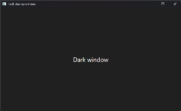

# Light flash when a dark WPF window opens

English · [Русский](README.RU.md)

A .NET 10 WPF window in the Fluent dark theme shows a light rectangle for a few frames before its dark
content appears. This folder holds a minimal repro, a fix, and the measurements behind both: every frame
DWM composed during 521 window starts, recorded with DXGI Desktop Duplication.

**In short**

- **Cause.** From `ShowWindow` until WPF's render thread presents the window's first frame, DWM composes
  the window from an unpainted surface, and that surface is white. The Windows 11 open animation fades it
  in, so it looks like a pale flash. The theme is not involved: a plain dark `SolidColorBrush`, the Mica
  backdrop and software rendering flash the same way.
- **Why the first frame is late.** An activated window spends about 40 ms of its UI thread on activation
  inside `ShowWindow`, and its first frame arrives 60–110 ms after the window became visible, long after DWM
  started drawing it. A window opened *without* activation has its first frame after about 12 ms, before DWM
  draws it, and does not flash.
- **Fix.** Cloak the window with `DWMWA_CLOAK` when it is activated as it opens, and uncloak it once its
  first frame is presented: in `ContentRendered`, after WPF's internal `MediaContext.CompleteRender`. Leave
  a window that opens without activation alone: [FirstFrameCloak.cs](FirstFrameCloak.cs). No flash in 50
  starts with the fix (activated or not, software rendering, Mica, an expensive first frame), against a flash
  in 10 of 10 starts without it.
- **Not earlier.** Uncloaking in `Loaded`, on `WM_ERASEBKGND` or on the first `CompositionTarget.Rendering`
  tick shows the white surface, and so does cloaking a window that opens without activation. Uncloaking in
  `ContentRendered` without waiting for the present is almost enough; it failed once in 6 starts on a busy
  machine, and always with an expensive first frame.

## Contents

| Path | What it is |
| --- | --- |
| `DarkStartupMinimal.csproj`, `Program.cs`, `MainWindow.xaml` | Minimal repro: `Application.ThemeMode = Dark`, one window |
| [`FirstFrameCloak.cs`](FirstFrameCloak.cs) | The fix; `--no-cloak` turns it off, `--no-activate` opens the window without activation |
| [`FlashProbe/`](FlashProbe) | Frame recorder: starts an app and measures its window in every composed frame |
| [`FlashLab/`](FlashLab) | The repro window with switchable startup variants ("modes") |
| [`Run-Experiments.ps1`](Run-Experiments.ps1) | Builds everything and runs a set of modes repeatedly |
| [`results/final-fix/`](results/final-fix) | The run that checks the fix: per start, per mode, and the machine |
| [`results/reference-run/`](results/reference-run) | All variants side by side, recorded before the fix waited for the present |
| [`results/exploratory-runs.csv`](results/exploratory-runs.csv) | The 287 starts recorded while investigating, before the reference run (their `minimal` is the first version of the fix: cloak in `SourceInitialized`, uncloak in `ContentRendered`) |
| [`results/frames/`](results/frames) | A few recorded frames |

Everything builds with the .NET 10 SDK alone.

## Run the repro

Windows 10 or 11 and the .NET 10 SDK:

```powershell
dotnet run --project DarkStartupMinimal.csproj                  # with the fix
dotnet run --project DarkStartupMinimal.csproj -- --no-cloak    # original behaviour: watch the window open
```

The flash is easiest to see over a dark background. Without the fix all 16 recorded starts of the two
reference runs flashed.

| Without the fix, 63 ms after the window became visible | Open animation off, 23 ms | With the fix: the first frame DWM shows, 101 ms |
| --- | --- | --- |
|  |  |  |

Recorded frames at one third of the size, over the grey backdrop FlashProbe puts behind the window. In the
first two the title bar is already dark, while the client area is the white surface: fading in, and at full
strength without the open animation.

## The fix

```csharp
// SourceInitialized: hook the window procedure. Activation arrives inside ShowWindow, right after the window
// became visible and before DWM has drawn it.
if (!cloaked && msg is WM_NCACTIVATE or WM_ACTIVATE && wParam != IntPtr.Zero && IsWindowVisible(hwnd))
{
    cloaked = true;
    SetCloaked(hwnd, true);             // DwmSetWindowAttribute(hwnd, DWMWA_CLOAK = 13, TRUE)
}

// ContentRendered: the UI thread has committed the first frame. Wait until the render thread has presented
// it (internal MediaContext.CompleteRender, called through reflection), then show the window.
if (cloaked)
{
    CompleteRender?.Invoke(window.Dispatcher);
    SetCloaked(hwnd, false);
}
```

The complete class is [FirstFrameCloak.cs](FirstFrameCloak.cs); attach it to a window before it is shown.
A cloaked window stays visible for Win32 (`WS_VISIBLE`) and WPF renders into it as usual; DWM just does not
draw it. Uncloaked, it appears at once with its dark content, without the Windows 11 open animation.

- **Why wait for the present?** `ContentRendered` fires when the UI thread has committed the first frame to
  the render thread. Usually the frame is on screen by then, but not always: in the reference run, 1 of 6
  starts that uncloaked right there showed about 30 ms of white (someone was using the machine), and a frame
  that is expensive to render (`heavy`) showed white every time. WPF has no public API that waits for a
  present. `MediaContext.CompleteRender` is internal; WPF calls it itself while a window is resized, and its
  comment says it "will only return after the last frame is presented". `FirstFrameCloak` finds it through
  reflection and, if a future WPF no longer has it, uncloaks without waiting.
- **Why only activated windows?** A window that opens without activation (a tray app opening a window while
  the user works elsewhere) renders its first frame about 12 ms after it became visible, before DWM draws it:
  it does not flash and needs no cloak. Cloaking it anyway adds a risk: once a window has been shown cloaked,
  DWM draws it immediately when uncloaked, without the short wait it gives a newly shown window, so
  uncloaking it in `ContentRendered` showed a white frame (`noactivate+cloak=cr`, 1 of 6).
- **Only the first show needs it.** Hiding the window and showing it again did not flash, because DWM keeps
  the rendered surface.

## What happens at startup

A typical start of the repro, from the FlashLab event log and the recorded frames (milliseconds relative to
the moment the window became `WS_VISIBLE`):

| ms | Activated window | Window opened without activation |
| ---: | --- | --- |
| −110 | `SourceInitialized`; WPF has already set `DWMWA_USE_IMMERSIVE_DARK_MODE`, so the title bar is dark from the first frame | same |
| −110…0 | `WM_SHOWWINDOW`: the UI thread waits while the render thread sets up Direct3D for the window (instant with software rendering) | same |
| 0 | The window becomes visible | same |
| ~5 | `WM_NCACTIVATE` / `WM_ACTIVATE`: activation work (focus, text services, …) keeps the UI thread busy for about 40 ms | — |
| ~5 | | First layout (`Loaded`) |
| ~12 | | First frame rendered (`ContentRendered`) and presented |
| 10–30 | DWM starts drawing the window: the unpainted white surface, fading in with the open animation | DWM starts drawing the window: its first frame is already there, dark |
| ~45 | First layout (`Loaded`), still inside `Window.Show()` | |
| 60–110 | First frame presented (`ContentRendered`); the dark content replaces the white surface | |

Why the surface is not dark: WPF registers its window class with `NULL_BRUSH` and answers `WM_ERASEBKGND`
without painting, so nothing is drawn until the render thread presents. With the open animation switched
off (`DWMWA_TRANSITIONS_FORCEDISABLED`) the client area is pure white (luma 255) for about 45 ms.

## How it was measured

[`FlashProbe`](FlashProbe) starts the app and takes every frame DWM composes
(`IDXGIOutputDuplication::AcquireNextFrame` on each monitor), measuring the average brightness (Rec. 709
luma, 0–255) of the window's client area and title bar at the window's position. The last frame before the
window became visible tells what is behind it; with `--backdrop` that is a plain grey window (luma 64), so
the numbers do not depend on the desktop.

- **Flash frame:** the client area is more than 8 brighter than both what is behind the window and the
  finished window. While the window fades in, it is a blend of those two; anything brighter can only come
  from the light surface.
- **Shown:** the first frame that differs from what is behind the window. **Never shown:** the window did
  not appear during the 1.5 s recording.
- **Covered:** another window lies over the centre of the target. Such frames show that window, so they are
  left out, and `Run-Experiments.ps1` counts those starts separately (see
  [the measurement pitfall](#a-measurement-pitfall-someone-using-the-machine)).
- FlashLab writes its steps (`Loaded`, `ContentRendered`, `Uncloaked`, …) to stdout with `Stopwatch`
  timestamps; the probe puts them on the same timeline.

Test machine ([environment.txt](results/final-fix/environment.txt)): Windows 11 Home 10.0.26200; .NET SDK
10.0.401 with the WindowsDesktop 10.0.12 runtime; the window opened on a 3840×2160 monitor at 60 Hz and
150 % scaling, driven by an NVIDIA GeForce RTX 4060 Laptop GPU (the laptop panel runs on an AMD Radeon
780M); window animations on, dark app theme.

## Results

### The fix: [results/final-fix](results/final-fix), 10 starts per mode

| Mode | What | Starts | With a flash | Never shown | Shown after (median) | Brightest frame |
| --- | --- | ---: | ---: | ---: | ---: | ---: |
| `minimal+no-cloak` | Repro, no fix | 10 | 10 | 0 | 39 ms | 143 |
| `minimal` | **Repro with `FirstFrameCloak`** | 10 | 0 | 0 | 117 ms | 64 |
| `minimal+no-activate` | **Repro opened without activation, with `FirstFrameCloak`** | 10 | 0 | 0 | 35 ms | 64 |
| `software+cloak=complete+onactivate` | The fix, software rendering | 10 | 0 | 0 | 110 ms | 64 |
| `mica+cloak=complete+onactivate` | The fix, Mica backdrop on | 10 | 0 | 0 | 119 ms | 64 |
| `cloak=complete+onactivate+heavy` | The fix, expensive first frame | 10 | 0 | 0 | 956 ms | 64 |

Recorded with FlashProbe's covered-window check; no start was covered.

### All variants: [results/reference-run](results/reference-run), 6 starts per mode

Recorded before `FirstFrameCloak` waited for the present: the rows marked "earlier" uncloak in
`ContentRendered` right away. One start (`cloak=cr+onshow~1`) is left out: its window lost the foreground
and was covered (see [the measurement pitfall](#a-measurement-pitfall-someone-using-the-machine)); this run
predates FlashProbe's covered-window check.

| Mode | What | Starts | With a flash | Never shown | Shown after (median) | Brightest frame |
| --- | --- | ---: | ---: | ---: | ---: | ---: |
| `minimal+no-cloak` | Repro, no fix | 6 | 6 | 0 | 30 ms | 183 |
| `minimal` | Repro with the earlier `FirstFrameCloak`: uncloak in `ContentRendered` without waiting for the present | 6 | 1 | 0 | 98 ms | 255 |
| `minimal+no-activate+no-cloak` | Repro opened without activation, no fix | 6 | 0 | 0 | 26 ms | 64 |
| `minimal+no-activate` | Repro opened without activation, earlier `FirstFrameCloak` | 6 | 0 | 0 | 27 ms | 64 |
| `plain` | No `ThemeMode`, dark `SolidColorBrush` | 6 | 6 | 0 | 32 ms | 182 |
| `mica` | Mica backdrop on | 6 | 5 | 0 | 30 ms | 161 |
| `software` | Software rendering | 6 | 6 | 0 | 32 ms | 144 |
| `nofade` | Open animation off | 6 | 6 | 0 | 11 ms | 255 |
| `erase` | Dark fill in `WM_ERASEBKGND` | 6 | 6 | 0 | 34 ms | 134 |
| `sync` | `Show()`, then render synchronously | 6 | 5 | 0 | 30 ms | 153 |
| `noime` | Text services off for the window | 6 | 6 | 0 | 31 ms | 118 |
| `cloak=loaded` | Cloak, uncloak in `Loaded` | 6 | 6 | 0 | 56 ms | 255 |
| `cloak=erase+erase` | Cloak, dark fill and uncloak on the first `WM_ERASEBKGND` | 6 | 3 | 0 | 51 ms | 255 |
| `cloak=tick` | Cloak, uncloak on the first `Rendering` tick | 6 | 5 | 0 | 57 ms | 255 |
| `cloak=opdone` | Cloak, uncloak right after the first render operation | 6 | 0 | 0 | 67 ms | 64 |
| `cloak=cr+onshow` | Cloak on `SWP_SHOWWINDOW`, uncloak in `ContentRendered` | 5 | 5 | 0 | 33 ms | 121 |
| `cloak=cr+rgn` | Empty window region instead of the cloak | 6 | 4 | 0 | 99 ms | 255 |
| `cloak=cr` | Cloak before `ShowWindow`, uncloak in `ContentRendered` | 6 | 0 | 0 | 110 ms | 64 |
| `noactivate+cloak=cr` | Same, window opened without activation | 6 | 1 | 0 | 17 ms | 255 |
| `noactivate+cloak=active` | Window opened without activation: cloak, uncloak in `Loaded` | 6 | 4 | 0 | 13 ms | 255 |
| `noactivate+cloak=showpos` | Window opened without activation: cloak, uncloak inside `ShowWindow` | 6 | 4 | 0 | 12 ms | 255 |
| `software+cloak=cr+onactivate` | Earlier fix, software rendering | 6 | 0 | 0 | 110 ms | 64 |
| `mica+cloak=cr+onactivate` | Earlier fix, Mica backdrop on | 6 | 0 | 0 | 98 ms | 64 |
| `cloak=frames` | Cloak, uncloak 3 `Rendering` ticks after `ContentRendered` | 6 | 0 | 0 | 135 ms | 64 |
| `cloak=complete+inval` | Cloak, uncloak after `CompleteRender`, then `InvalidateRect` | 6 | 0 | 0 | 101 ms | 64 |
| `cloak=late` | Cloak, uncloak 300 ms after `ContentRendered` | 6 | 0 | 0 | 417 ms | 64 |
| `heavy` | Expensive first frame, no fix | 6 | 6 | 0 | 31 ms | 255 |
| `cloak=cr+onactivate+heavy` | Earlier fix, expensive first frame | 6 | 6 | 0 | 129 ms | 255 |
| `reshow` | No fix, hidden and shown again | 6 | 5 | 0 | 26 ms | 162 |

Behind the window is the grey backdrop (luma 64) and the finished window has luma 33, so a brightest frame
of 64 means nothing brighter than the backdrop was on screen; 255 is pure white. In `reshow` every flash
frame came during the first show (31–69 ms); showing the window again did not flash.

## What does not work

- **Another theme setup.** `plain` (no `ThemeMode`, dark `SolidColorBrush`), `mica` (Fluent Mica backdrop
  on) and `software` (software rendering) flash like the repro.
- **Painting the background in `WM_ERASEBKGND`** (`erase`). WPF gets the message about 40 ms after the
  window became visible, when DWM already shows the white surface, and the GDI paint does not replace it.
- **Rendering earlier** (`sync`). `Window.Show()` does the first layout after `ShowWindow`, so the first
  frame cannot be presented before the white surface is on screen.
- **Disabling text services for the window** (`noime`). Makes the first frame about 30 ms earlier; still
  flashes.
- **Switching off the open animation** (`nofade`). Worse: the white surface is shown at full strength.
- **Uncloaking before the first present**: in `Loaded`, on the first `WM_ERASEBKGND` (both suggested in
  [dotnet/wpf#5853](https://github.com/dotnet/wpf/issues/5853)) or on the first
  `CompositionTarget.Rendering` tick (`cloak=loaded`, `cloak=erase`, `cloak=tick`). DWM shows the white
  surface at once, unfaded. Uncloaking right after the first render operation (`cloak=opdone`) is
  borderline.
- **Cloaking a window that opens without activation**, then uncloaking it in `ContentRendered`, in `Loaded`
  or inside `ShowWindow` (`noactivate+cloak=cr`, `cloak=active`, `cloak=showpos`): a white frame, where the
  same window without the cloak does not flash.
- **Cloaking only once the window is shown** (`onshow`, on `WM_WINDOWPOSCHANGED` with `SWP_SHOWWINDOW`).
  Too late for an activated window: that message comes after the activation work, when DWM has already drawn
  the window.
- **An empty window region instead of the cloak** (`rgn`). Resetting the region brings back a white frame.

## A measurement pitfall: someone using the machine

In 8 of the exploratory batches the window stopped appearing in the recordings: not even its title bar was
seen. It always began in the middle of a batch, after 7 to 19 starts, and then affected every remaining
start of that batch (40 starts in total); those starts also had an early first frame (`ContentRendered`
28–62 ms after the window became visible instead of 60–110 ms). They happened to be the variants that
uncloak late, which at first looked like a WPF or DWM problem with presenting into a cloaked window.

It is most likely a recording artifact. While someone uses the machine, Windows does not let a background
process take the foreground
([foreground lock](https://learn.microsoft.com/windows/win32/api/winuser/nf-winuser-setforegroundwindow)),
so the new window opens without full activation, which also explains the early first frame, and can end up
behind the window in use, out of the recorder's view. The reference run had one such start
(`cloak=cr+onshow`): its window was activated but was no longer the foreground window at `ContentRendered`,
the grey backdrop was covered as well, and the window never showed up in the frames. The late-uncloak
variants had no such starts in the reference run.

FlashProbe therefore checks, for every frame, whether another window covers the centre of the target
(`WindowFromPoint`), leaves covered frames out of the metrics and reports them (`covered_frames`);
`Run-Experiments.ps1` counts such starts separately. The exploratory runs were recorded before that check;
their never-shown starts are the ones with an empty `shown_ms` in
[`results/exploratory-runs.csv`](results/exploratory-runs.csv).

## Limits

- The wait for the present relies on an internal WPF method. Without it (should a future WPF drop it),
  `FirstFrameCloak` uncloaks in `ContentRendered` right away; the "earlier" rows above show how that does.
- The window appears only once its first frame is on screen: with an expensive first frame (`heavy`,
  about 0.9 s) it appears that much later, dark instead of white.
- One machine (see above). The timings depend on GPU, driver, refresh rate and load; so does whether a window
  opened without activation beats DWM.
- An activated window loses the Windows 11 open animation.

## Reproduce

```powershell
pwsh ./Run-Experiments.ps1 -Runs 6 -Name my-run     # all default modes, about 14 minutes
pwsh ./Run-Experiments.ps1 -Runs 10 -Name my-fix-check -Modes minimal+no-cloak,minimal,minimal+no-activate,software+cloak=complete+onactivate,mica+cloak=complete+onactivate,cloak=complete+onactivate+heavy
```

Windows open in the middle of the primary monitor over a grey backdrop; leave the machine alone while the
script runs. It prints one line per start and a table per mode, and writes `results/<name>/`
(`summary.csv`, `aggregate.csv`, `environment.txt`; the per-start frame and event files in `runs/` are not
committed). Modes starting with `minimal` run the repro, each `+flag` becoming `--flag`
(`minimal+no-activate+no-cloak`); all other modes run FlashLab. A single start by hand:

```powershell
FlashProbe/bin/Release/net10.0-windows/FlashProbe.exe FlashLab/bin/Release/net10.0-windows10.0.19041.0/FlashLab.exe `
    --args "cloak=cr" --backdrop --save 300 --verbose --out probe-output
```

`--save <ms>` writes every frame of the first milliseconds as PNG; `--snapshot` saves the whole screen when
the recording ends (useful when a window never appears).

### FlashLab modes

A mode is a list of flags joined by `+`, for example `software+cloak=cr` or `cloak=frames+inval`. Without
flags (`baseline`) FlashLab is the repro without the fix.

| Flag | Effect |
| --- | --- |
| `plain` | No `ThemeMode`; the window background is a `#202020` `SolidColorBrush` |
| `mica` | Turns the Fluent Mica backdrop back on (the csproj disables it, like the app this came from) |
| `software` | `RenderOptions.ProcessRenderMode = SoftwareOnly` |
| `noactivate` | `ShowActivated = false`: the window opens without activation |
| `noime` | `InputMethod.IsInputMethodEnabled = false` on the window |
| `heavy` | Adds an element whose first frame takes the render thread about 0.9 s |
| `erase` | Paints the client area `#202020` on `WM_ERASEBKGND` |
| `nofade` | `DWMWA_TRANSITIONS_FORCEDISABLED`: no open animation |
| `sync` | `Show()`, then layout and render synchronously before `Application.Run` |
| `forcefast` | In `Loaded`: render and wait for the present (`MediaContext.CompleteRender`, via reflection) |
| `delayrender` | In `Loaded`: sleep 300 ms, delaying the first frame |
| `reshow` | Hide the window 600 ms after the first frame and show it again 600 ms later |
| `cloak=<when>` | `DWMWA_CLOAK` in `SourceInitialized`, uncloak at `<when>`: `loaded`; `erase` (first `WM_ERASEBKGND`); `tick` (first `CompositionTarget.Rendering`); `opdone` (right after the first render operation); `cr` (`ContentRendered`); `active` (in `Loaded` if the window is not active, else `ContentRendered`); `showpos` (inside `ShowWindow` if the window did not become active, else `ContentRendered`); `frames` (three `Rendering` ticks after `ContentRendered`); `frames-post` (same, then a `Background` dispatcher post); `complete` (after `MediaContext.CompleteRender`); `late` (300 ms after `ContentRendered`) |
| `onactivate` | With `cloak=`: cloak on the first `WM_NCACTIVATE`/`WM_ACTIVATE` instead of in `SourceInitialized`. `cloak=complete+onactivate` is what `FirstFrameCloak` does |
| `onshow` | With `cloak=`: cloak on `WM_WINDOWPOSCHANGED` with `SWP_SHOWWINDOW` instead of in `SourceInitialized` |
| `rgn` | With `cloak=`: hide with an empty window region (`SetWindowRgn`) instead of `DWMWA_CLOAK` |
| `inval`, `rm`, `framechanged` | After uncloaking: `InvalidateRect`; switch `HwndTarget.RenderMode` to software and back; `SWP_FRAMECHANGED` |

## References

- [dotnet/wpf#5853](https://github.com/dotnet/wpf/issues/5853): "Apps with a custom background flash a white
  background for a couple frames on some devices" (open since 2021).
- WPF sources, `release/10.0` at [2565b01](https://github.com/dotnet/wpf/tree/2565b0112868a77d29992c86a0c695c9d4d6d7fb):
  - window class with `NULL_BRUSH`: [HwndWrapper.cs#L57](https://github.com/dotnet/wpf/blob/2565b0112868a77d29992c86a0c695c9d4d6d7fb/src/Microsoft.DotNet.Wpf/src/Shared/MS/Win32/HwndWrapper.cs#L57), [#L101](https://github.com/dotnet/wpf/blob/2565b0112868a77d29992c86a0c695c9d4d6d7fb/src/Microsoft.DotNet.Wpf/src/Shared/MS/Win32/HwndWrapper.cs#L101)
  - `WM_ERASEBKGND` handled without painting: [HwndTarget.cs#L1034](https://github.com/dotnet/wpf/blob/2565b0112868a77d29992c86a0c695c9d4d6d7fb/src/Microsoft.DotNet.Wpf/src/PresentationCore/System/Windows/InterOp/HwndTarget.cs#L1034)
  - dark title bar and backdrop applied before `ShowWindow`: [Window.cs#L2578-L2597](https://github.com/dotnet/wpf/blob/2565b0112868a77d29992c86a0c695c9d4d6d7fb/src/Microsoft.DotNet.Wpf/src/PresentationFramework/System/Windows/Window.cs#L2578-L2597)
  - `MediaContext.CompleteRender`, "a sync flush, which will only return after the last frame is presented": [MediaContext.cs#L2206](https://github.com/dotnet/wpf/blob/2565b0112868a77d29992c86a0c695c9d4d6d7fb/src/Microsoft.DotNet.Wpf/src/PresentationCore/System/Windows/Media/MediaContext.cs#L2206)
- [`DWMWA_CLOAK`](https://learn.microsoft.com/windows/win32/api/dwmapi/ne-dwmapi-dwmwindowattribute) and
  [Desktop Duplication](https://learn.microsoft.com/windows/win32/direct3ddxgi/desktop-dup-api) on Microsoft Learn.

## License

[MIT](LICENSE), Copyright (c) 2026 Evgeny Vladimircev.
